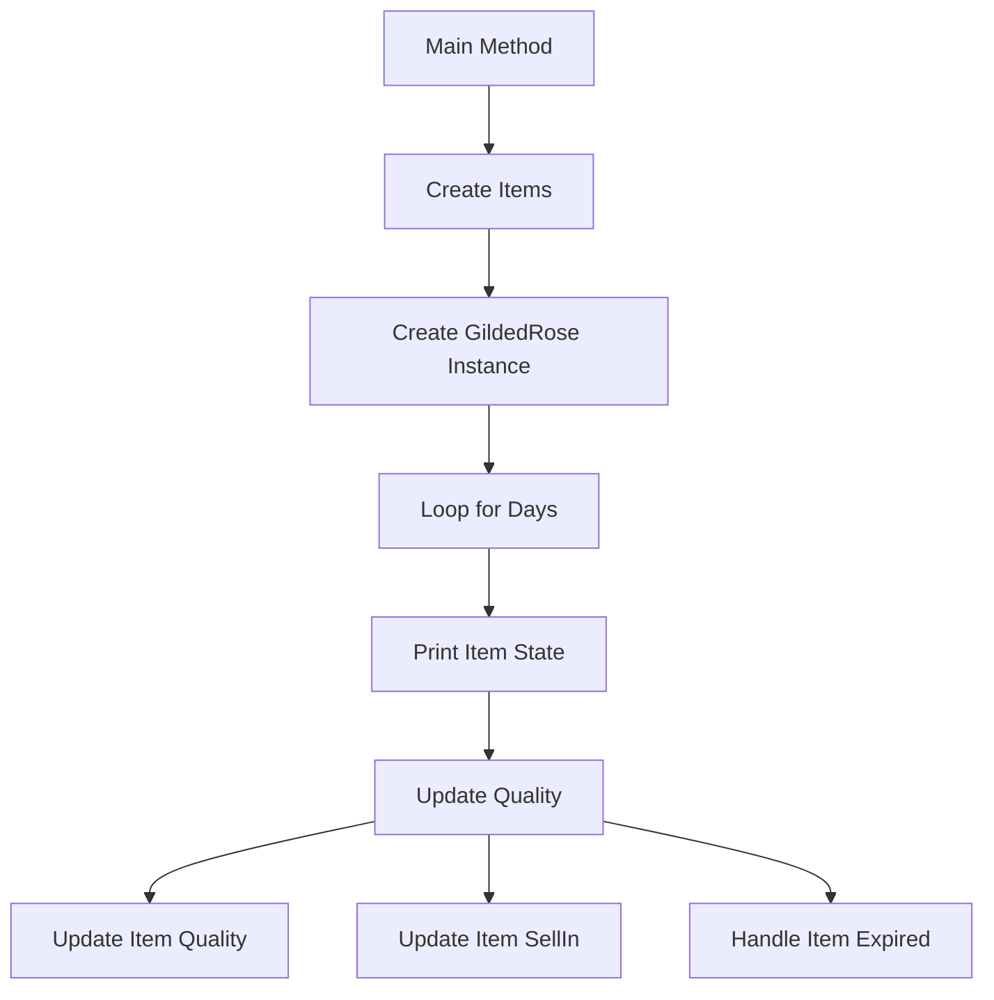

```mermaid
classDiagram
    class Program {
        +Main(string[] args)
        -CreateItems() : IList<Item>
    }

    class GildedRose {
        -IList<Item> Items
        +GildedRose(IList<Item> Items)
        +UpdateQuality()
    }

    class Item {
        +ItemData Data
        +Item(string name, int sellIn, int quality)
        +UpdateQuality()
        +UpdateSellIn()
        +HandleExpired()
        -IncreaseQuality()
        -DecreaseQuality()
        -UpdateBackstagePassQuality()
    }

    class ItemData {
        +string Name
        +int SellIn
        +int Quality
        +ItemData(string name, int sellIn, int quality)
    }

    Program --> GildedRose
    GildedRose --> Item
    Item --> ItemData
```

```mermaid
sequenceDiagram
    participant User
    participant Program
    participant GildedRose
    participant Item

    User ->> Program: Run Application
    Program ->> Program: Create Items
    Program ->> GildedRose: Create Instance
    Program ->> GildedRose: UpdateQuality
    GildedRose ->> Item: UpdateQuality
    Item ->> Item: UpdateQuality
    Item ->> Item: UpdateSellIn
    Item ->> Item: HandleExpired
    Program ->> User: Print Item State
