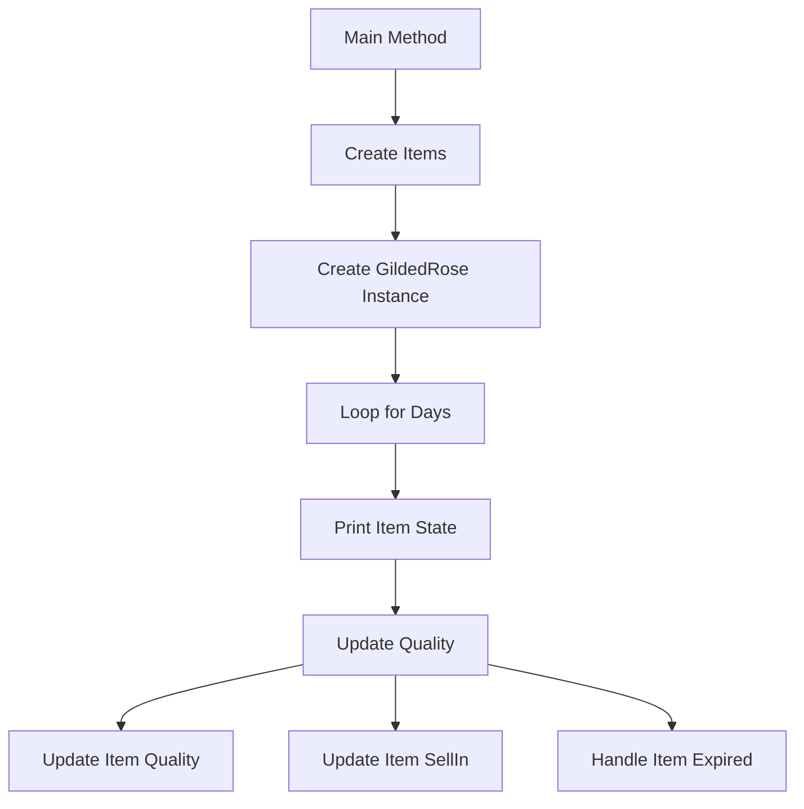
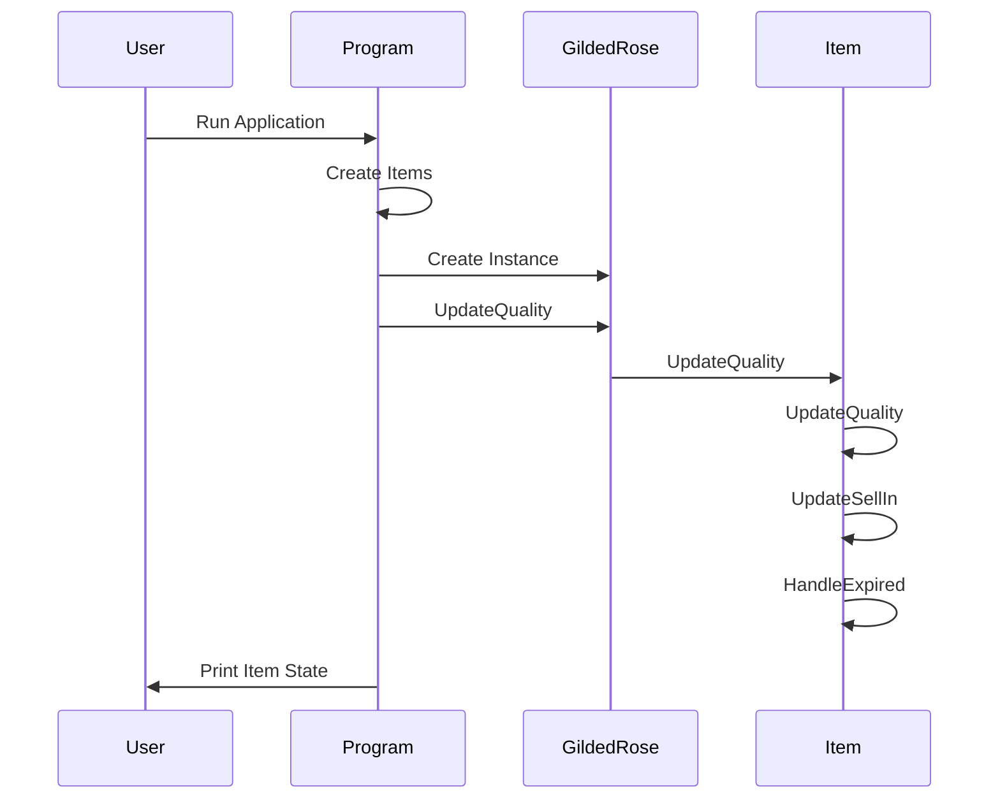
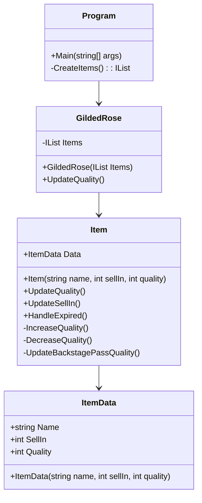
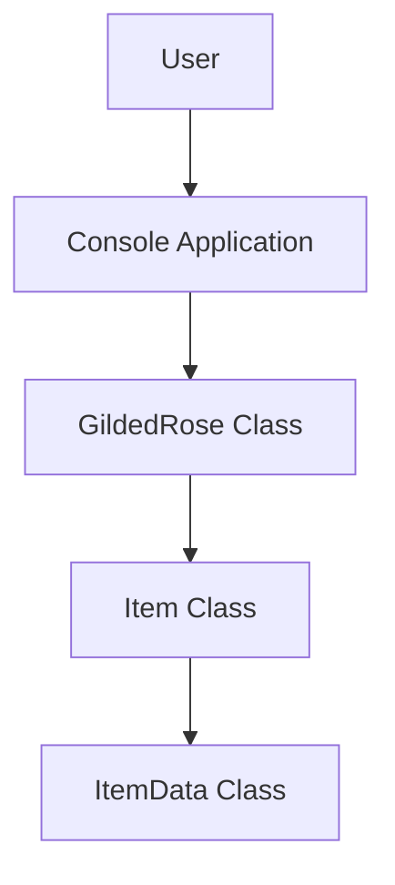
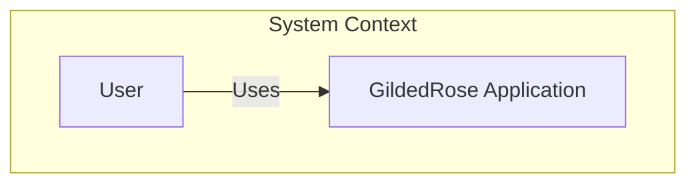
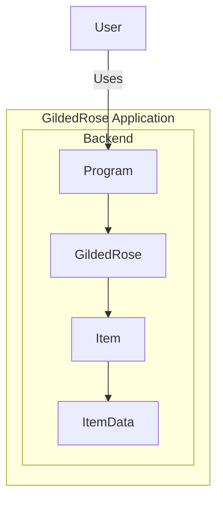
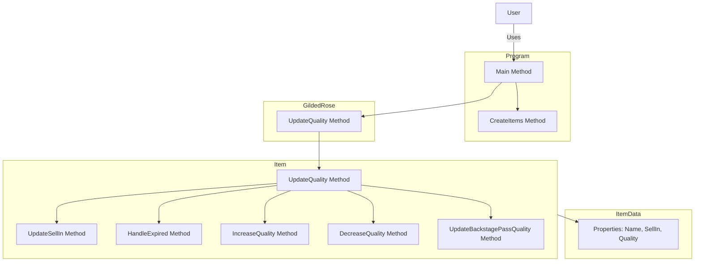

```mermaid
classDiagram
    class Program {
        +Main(string[] args)
        -CreateItems() : IList<Item>
    }

    class GildedRose {
        -IList<Item> Items
        +GildedRose(IList<Item> Items)
        +UpdateQuality()
    }

    class Item {
        +ItemData Data
        +Item(string name, int sellIn, int quality)
        +UpdateQuality()
        +UpdateSellIn()
        +HandleExpired()
        -IncreaseQuality()
        -DecreaseQuality()
        -UpdateBackstagePassQuality()
    }

    class ItemData {
        +string Name
        +int SellIn
        +int Quality
        +ItemData(string name, int sellIn, int quality)
    }

    Program --> GildedRose
    GildedRose --> Item
    Item --> ItemData
```







```mermaid
%% C4 Code Diagram
graph TD
    subgraph Program [Program]
        Main[Main Method]
        CreateItems[CreateItems Method]
    end
    subgraph GildedRose [GildedRose]
        UpdateQuality[UpdateQuality Method]
    end
    subgraph Item [Item]
        UpdateQualityItem[UpdateQuality Method]
        UpdateSellIn[UpdateSellIn Method]
        HandleExpired[HandleExpired Method]
        IncreaseQuality[IncreaseQuality Method]
        DecreaseQuality[DecreaseQuality Method]
        UpdateBackstagePassQuality[UpdateBackstagePassQuality Method]
    end
    subgraph ItemData [ItemData]
        Properties[Properties: Name, SellIn, Quality]
    end
    User[User] -->|Uses| Main
    Main --> CreateItems
    Main --> UpdateQuality
    UpdateQuality --> UpdateQualityItem
    UpdateQualityItem --> UpdateSellIn
    UpdateQualityItem --> HandleExpired
    UpdateQualityItem --> IncreaseQuality
    UpdateQualityItem --> DecreaseQuality
    UpdateQualityItem --> UpdateBackstagePassQuality
    Item --> Properties

